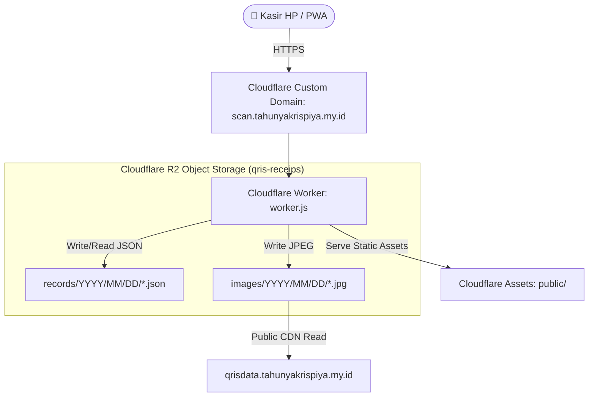

# 🥟 QRIS Kas - Tahunya Krispiya
### *Ultra-Fast Serverless QRIS Payment Logger & Cashier PWA*

[](https://workers.cloudflare.com/)
[](https://www.cloudflare.com/developer-platform/r2/)
[](https://developer.mozilla.org/)
[](https://web.dev/progressive-web-apps/)
[](https://scan.tahunyakrispiya.my.id)

**QRIS Kas** adalah sub-aplikasi kasir digital dari ekosistem **Tahunya Krispiya** yang dirancang untuk memotret, mencatat, dan mengarsipkan bukti pembayaran QRIS secara instan di gerai fisik. Dibangun di atas infrastruktur serverless global Cloudflare Workers & R2 Storage dengan performa tinggi dan nol biaya server bulanan.

🌐 **Website Utama**: [tahunyakrispiya.my.id](https://tahunyakrispiya.my.id)  
📱 **Aplikasi Kasir**: [scan.tahunyakrispiya.my.id](https://scan.tahunyakrispiya.my.id)  
🗄️ **CDN Bukti Foto**: `https://qrisdata.tahunyakrispiya.my.id`

---

## ⚡ Fitur Utama

- 📸 **Jepret Cepat Meja Kasir**: Mengambil foto struk pembayaran langsung dari kamera HP, otomatis menetapkan waktu transaksi (WIB), dan membuka dialog nominal tanpa hambatan PIN.
- 📁 **Dukungan Bukti Galeri / WhatsApp**: Menerima upload screenshot pembayaran dari chat pelanggan dengan opsi penyesuaian jam manual.
- 📊 **Rekap Harian 1-Klik ke WhatsApp**: Mengkalkulasi total penjualan harian dan menyusun pesan rekap terformat lengkap beserta tautan foto bukti transaksi.
- 🔐 **Keamanan Kriptografi Bertingkat (Defense in Depth)**:
  - Token sesi stateless berbasis **HMAC-SHA256**.
  - Proteksi anti-brute force lockout pada login.
  - Otorisasi bertingkat: Input tanpa PIN, Edit transaksi wajib **PIN 6-Digit**, dan Hapus transaksi wajib **Verifikasi 2-Langkah (PIN + Password Admin)**.
- ☁️ **Arsitektur Partisi Tanggal R2**: Penyimpanan objek hierarkis `records/YYYY/MM/DD/` untuk query super cepat berbasis prefix tanpa database relasional yang mahal.

---

## 🏗️ Topologi Arsitektur



---

## 📚 Dokumentasi Lengkap & PRD

Dokumentasi proyek ini disusun secara komprehensif ke dalam folder [`docs/`](./docs/INDEX.md):

* 📖 **[Panduan Bahasa Manusia & Pemilik Bisnis (Non-Teknis)](./docs/PANDUAN_MANUSIA_AWAM_DAN_BISNIS.md)** — Panduan praktis operasional kasir, skenario harian, dan kamus istilah awam.
* 🏛️ **[PRD-01: Arsitektur Sistem Global & Tech Stack](./docs/PRD-01_SYSTEM_ARCHITECTURE_AND_STACK.md)**
* 🔐 **[PRD-02: Model Keamanan, Autentikasi & Otorisasi Bertingkat](./docs/PRD-02_AUTHENTICATION_AND_SECURITY.md)**
* 📱 **[PRD-03: Frontend UI, UX & Alur Kerja Klien](./docs/PRD-03_FRONTEND_UI_AND_WORKFLOW.md)**
* 🗄️ **[PRD-04: Spesifikasi REST API & Skema Database R2](./docs/PRD-04_API_SPECIFICATION_AND_R2_STORAGE.md)**
* 🚀 **[PRD-05: Panduan DevOps, Deployment & Operational Runbook](./docs/PRD-05_DEPLOYMENT_DEVOPS_AND_RUNBOOK.md)**

---

## 🚀 Memulai (Quick Start)

### 1. Prasyarat
- [Node.js](https://nodejs.org/) v18+ atau v20 LTS
- Akun [Cloudflare](https://dash.cloudflare.com/)

### 2. Instalasi & Pengembangan Lokal
```bash
# Clone repository
git clone https://github.com/USERNAME/qris-kas.git
cd qris-kas

# Instalasi dependensi
npm install

# Kompilasi frontend bundle
npm run build

# Jalankan server lokal
npm run dev
```

### 3. Konfigurasi Cloudflare Worker Secrets
Konfigurasi rahasia autentikasi dan PIN secara aman (tidak pernah di-commit ke Git):
```bash
npx wrangler secret put AUTH_USERNAME
npx wrangler secret put AUTH_PASSWORD
npx wrangler secret put AUTH_SECRET
npx wrangler secret put DELETE_PIN
```

### 4. Deploy ke Produksi
```bash
npm run deploy
```

---

## 🔒 Catatan Privasi & Keamanan

- **Zero Hardcoded Secrets**: Seluruh kredensial dan PIN dienkripsi menggunakan *Cloudflare Worker Secrets*.
- **Data Protection**: File `.gitignore` telah dikonfigurasi untuk mencegah file lokal sensitif, `.env`, `.dev.vars`, atau foto transaksi privat terunggah ke repositori publik.

---

## 📄 Lisensi & Hak Cipta
Hak Cipta © 2026 **Tahunya Krispiya**. Seluruh hak cipta dilindungi undang-undang.
