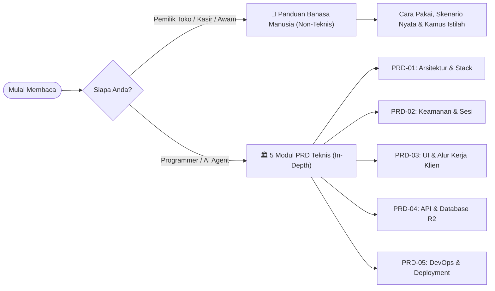
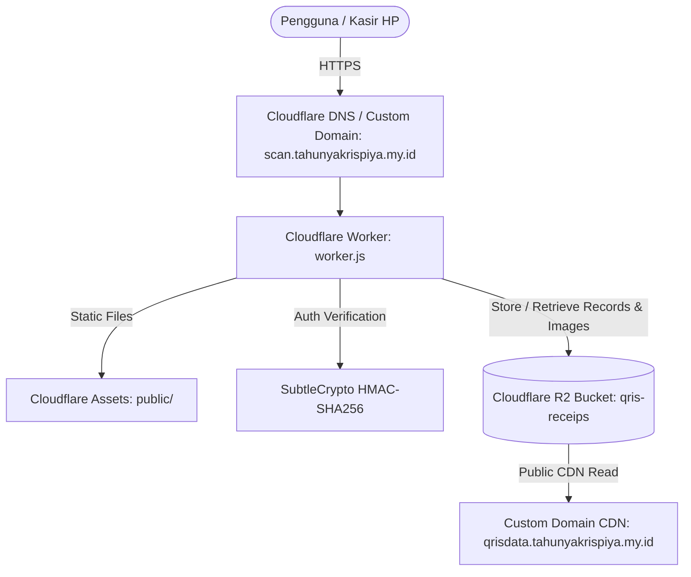

# QRIS Nominal Scanner - Master Documentation & PRD Index

Selamat datang di repositori dokumentasi lengkap (**Product Requirement Document / System Specification**) untuk proyek **QRIS Nominal Scanner (QRIS Kas)**.

Dokumentasi ini dirancang dengan struktur berlapis (*layered architecture*):
1. **Untuk Manusia Biasa & Pemilik Toko**: Penjelasan bahasa sehari-hari, alur operasional kasir, dan skenario nyata tanpa jargon rumit.
2. **Untuk AI Agent & Developer**: Spesifikasi teknis mendalam ke akar-akarnya, arsitektur serverless, kriptografi, API, dan skema database objek.

---

## 🧭 Pilih Jalur Bacaan Sesuai Kebutuhan Anda

---

## 👨‍💼 Jalur 1: Untuk Manusia Biasa & Pemilik Bisnis (Non-Teknis)

👉 **Buka Dokumen Utama**: **[📖 Panduan Bahasa Manusia: Cara Kerja & Penggunaan QRIS Kas](file:///c:/ocr%20gas/docs/PANDUAN_MANUSIA_AWAM_DAN_BISNIS.md)**

* **Apa yang dibahas?**
  * Konsep dasar aplikasi (Buku Catatan Kasir Digital di Awan).
  * 5 Skenario Nyata di Lapangan (Jepret saat ramai, upload bukti dari WhatsApp, kirim rekap sore ke Bos, edit nominal salah, hapus data salah).
  * Kamus padanan istilah bahasa manusia vs istilah programmer.

---

## 🤖 Jalur 2: Untuk AI Agent & Software Engineer (Spesifikasi Teknis Lengkap)

Dokumentasi teknis dibagi menjadi 5 modul PRD spesifik:

| Dokumen PRD | Fokus & Domain Kerja | Deskripsi Singkat |
|---|---|---|
| **[01 - System Architecture & Tech Stack](file:///c:/ocr%20gas/docs/PRD-01_SYSTEM_ARCHITECTURE_AND_STACK.md)** | Arsitektur Sistem Global & Dependensi | Gambaran arsitektur serverless, topologi Cloudflare, direktori kerja, environment variables, & dependensi package. |
| **[02 - Authentication & Security Model](file:///c:/ocr%20gas/docs/PRD-02_AUTHENTICATION_AND_SECURITY.md)** | Keamanan, Sesi & Otorisasi Bertingkat | HMAC-SHA256 session token, proteksi brute-force, RBAC (Admin vs Guest), otorisasi Edit PIN, dan Verifikasi Hapus 2-Langkah. |
| **[03 - Frontend UI & Client Workflows](file:///c:/ocr%20gas/docs/PRD-03_FRONTEND_UI_AND_WORKFLOW.md)** | Frontend UI/UX, Kamera, & Alur Klien | Alur input cepat via kamera vs galeri, state management DOM, sistem bundling esbuild, UI token, dan integrasi WhatsApp. |
| **[04 - API Specification & R2 Storage Engine](file:///c:/ocr%20gas/docs/PRD-04_API_SPECIFICATION_AND_R2_STORAGE.md)** | Kontrak REST API & Skema Database R2 | Spesifikasi lengkap endpoint HTTP, skema partisi direktori tanggal R2 (`records/` & `images/`), metadata custom, dan operasi batch. |
| **[05 - DevOps, Deployment & Operational Runbook](file:///c:/ocr%20gas/docs/PRD-05_DEPLOYMENT_DEVOPS_AND_RUNBOOK.md)** | Deployment, Wrangler & Troubleshooting | Panduan `wrangler.toml`, pengelolaan Worker Secrets, custom domain, alur CI/CD build-deploy, dan panduan troubleshooting error. |

---

## 🌟 Ringkasan Eksekutif Sistem

QRIS Nominal Scanner adalah aplikasi pencatatan bukti transaksi kasir berbasis web (*Progressive Web App*) yang dioptimalkan untuk perangkat seluler. Sistem ini dirancang dengan prinsip **High-Speed Entry, Zero Overhead, Serverless Scale, and Multi-Tier Security**:

---

## ⚡ Panduan Cepat untuk AI Agent / Developer Baru

1. **Kode Sumber Utama Frontend**: [`src/app.js`](file:///c:/ocr%20gas/src/app.js)
   * Selalu edit di `src/app.js`, lalu kompilasi dengan `npm run build` yang menghasilkan [`public/app.js`](file:///c:/ocr%20gas/public/app.js).
2. **Kode Sumber Utama Backend**: [`worker.js`](file:///c:/ocr%20gas/worker.js)
   * Menangani autentikasi, API RESTful, interaksi dengan bucket Cloudflare R2, dan serving aset statis.
3. **Konfigurasi Serverless**: [`wrangler.toml`](file:///c:/ocr%20gas/wrangler.toml)
   * Berisi binding R2 `RECEIPTS`, binding `ASSETS`, variabel publik `R2_PUBLIC_URL`, dan konfigurasi custom domain.
4. **Perintah Build & Deploy**:
   * Build frontend: `npm run build`
   * Menjalankan lokal: `npm run dev`
   * Deploy ke Cloudflare: `npm run deploy`
