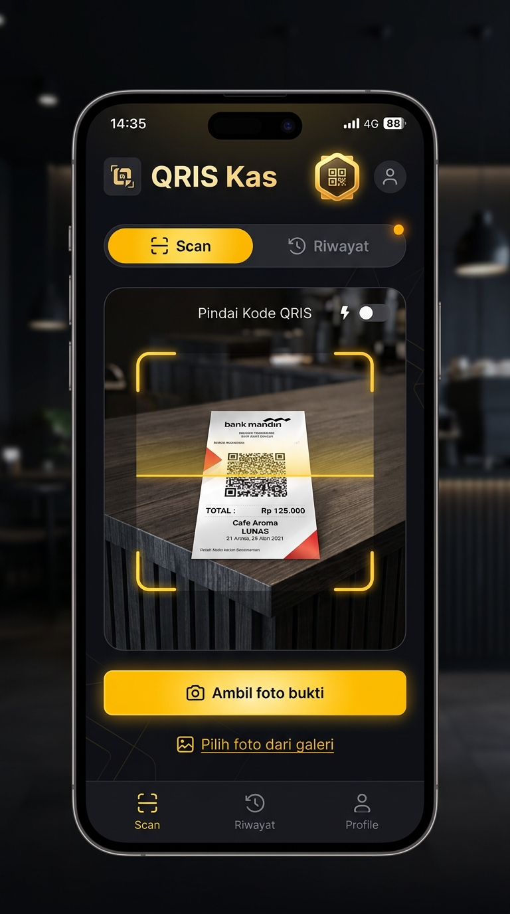
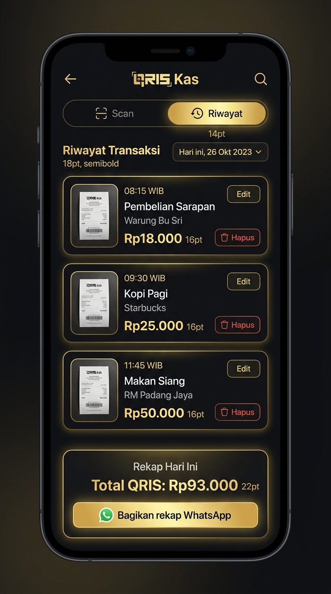

# 📖 Panduan Bahasa Manusia: Cara Kerja & Penggunaan QRIS Kas

  

> **Dokumen ini dibuat khusus dengan bahasa sehari-hari tanpa istilah teknis yang rumit, agar pemilik toko, manajer operasional, kasir, dan siapa pun dapat langsung memahami dan menggunakan sistem ini dalam 3 menit.**

---

## 📱 Gambar Tampilan Aplikasi di HP Kasir

  
  

  <em>(Kiri: Layar Scan saat jepret bukti pembayaran | Kanan: Layar Riwayat & Rekap Harian)</em>

---

## 1. Aplikasi Ini Sebenarnya Apa?

Bayangkan Anda punya toko fisik, dan banyak pembeli yang membayar pakai QRIS (GoPay, OVO, BCA, Dana, ShopeePay, dll).
Biasanya, kasir sering bingung:
* *"Tadi yang beli Rp18.000 beneran sudah bayar belum ya?"*
* *"Foto bukti transfernya numpuk di galeri HP pribadi kasir dan bikin memori HP penuh."*
* *"Waktu toko tutup, kasir dan bos harus ngitung manual satu per satu struk transfer."*

**QRIS Kas** adalah **Buku Catatan Kasir Digital di Awan (Cloud)**:
1. Kasir tinggal **jepret** layar HP pembeli yang menampilkan struk sukses QRIS.
2. Ketik nominal uangnya (misal: `18.000`).
3. Tekan **Simpan**.
4. Foto otomatis tersimpan aman di server awan (tidak bikin HP kasir lemot), dan otomatis tercatat jamnya.
5. Saat toko tutup, tinggal klik **Bagikan Rekap ke WhatsApp** — bos langsung menerima total setoran harian lengkap beserta link foto buktinya!

---

## 2. Siapa Saja yang Menggunakan dan Apa Perannya?

| Siapa? | Peran / Akun | Apa yang Bisa Dilakukan? |
|---|---|---|
| 🧑‍💼 **Kasir / Karyawan Toko** | **Admin / Kasir** | • Memotret struk QRIS pembeli. • Memasukkan nominal rupiah. • Menyimpan transaksi langsung (tanpa ribet diminta PIN). • Melihat riwayat transaksi hari ini. |
| 👁️ **Auditor / Rekan Shift** | **Guest (Mode Intip)** | • Hanya bisa melihat riwayat transaksi dan total rekap harian. • Tidak bisa memotret, mengedit, atau menghapus data. |
| 👑 **Pemilik Toko / Bos** | **Super Admin** | • Menerima rekap penjualan via WhatsApp. • Bisa mengedit transaksi jika ada kasir yang salah ketik nominal (wajib masukkan **PIN 6-Digit**). • Bisa menghapus transaksi salah (wajib masukkan **PIN + Password Toko**). |

---

## 3. Alur Praktis Penggunaan Sehari-hari (Skenario Lapangan)

### 📸 Skenario A: Ada Pembeli di Depan Kasir (Jepret Langsung)
1. Pembeli menunjukkan bukti sukses QRIS di layar HP mereka.
2. Kasir membuka web di HP toko, tekan tombol kuning **"Ambil foto bukti"**.
3. Layar pop-up langsung muncul meminta nominal.
4. Kasir ketik `18000`, lalu tekan tombol **Gunakan** (atau tekan Enter di keyboard HP).
5. Kasir tekan **Simpan**.
6. **Selesai!** Transaksi tercatat dengan jam saat itu juga. **Tidak perlu masukkan PIN** agar tidak antre lama.

---

### 📁 Skenario B: Pembeli Kirim Bukti Transfer Lewat WA (Ambil dari Galeri)
1. Pembeli transfer dari jauh dan kirim screenshot bukti ke WhatsApp toko.
2. Kasir klik tombol **"📁 Pilih foto dari galeri"** dan pilih screenshot tersebut.
3. Karena foto ini diambil beberapa menit/jam yang lalu, pop-up akan menampilkan **Jam Transaksi**.
4. Kasir ketik nominal dan sesuaikan jamnya (misal jam transfer `14:30`).
5. Kasir tekan **Gunakan**, lalu tekan **Simpan**.
6. **Selesai!** Transaksi tercatat dengan jam transfer yang sesuai, **tetap tanpa perlu PIN**.

---

### 📊 Skenario C: Toko Tutup / Ganti Shift (Kirim Rekap ke Bos)
1. Buka tab **Riwayat**.
2. Pilih tanggal hari ini (otomatis terpilih).
3. Di bagian bawah layar akan muncul kotak hijau/emas berisi **Total QRIS** (contoh: `Rp1.250.000`).
4. Klik tombol **"Bagikan rekap WhatsApp"**.
5. WhatsApp otomatis terbuka dengan pesan tersusun rapi yang berisi:
   - Jam tiap transaksi.
   - Nominal tiap transaksi.
   - Total penjualan hari itu.
   - Link foto bukti tiap transaksi untuk dicek bos kapan saja.

---

### ✏️ Skenario D: Kasir Salah Ketik Nominal (Mau Edit)
1. Kasir melapor ke Bos bahwa ada salah ketik (misal harusnya `25.000` tapi terketik `2.500`).
2. Di tab Riwayat, klik tombol **Edit** pada transaksi tersebut.
3. Masukkan nominal yang benar dan jam yang benar.
4. Masukkan **PIN Rahasia 6-Digit** pemilik toko.
5. Data langsung terupdate rapi. *(Kasir yang tidak tahu PIN tidak akan bisa asal ubah data).*

---

### 🗑️ Skenario E: Transaksi Dobel / Batal (Mau Hapus)
1. Di tab Riwayat, klik tombol **Hapus** berwarna merah.
2. Muncul kotak pengaman **Verifikasi 2-Langkah**:
   - Langkah 1: Masukkan **PIN Hapus (6 Digit)**.
   - Langkah 2: Masukkan **Password Toko**.
3. Klik **Hapus Permanen**.
4. Catatan dan foto bukti di server akan langsung terhapus bersih.

---

## 4. Kamus Bahasa Manusia vs Bahasa Programmer

Agar Anda tidak bingung saat membaca istilah-istilah di dokumen teknis lainnya, berikut padanan artinya:

| Istilah Bahasa Programmer | Bahasa Manusiawi Sehari-hari | Fungsinya Apa? |
|---|---|---|
| **Cloudflare Workers** | Mesin Program di Awan | Otak server yang memproses aplikasi secara online tanpa perlu komputer server fisik yang nyala terus. |
| **Cloudflare R2** | Lemari Brankas Foto di Awan | Tempat penyimpanan foto bukti dan catatan transaksi yang sangat aman, cepat, dan hemat biaya. |
| **PWA (Progressive Web App)** | Web yang Serasa Aplikasi HP | Website yang bisa diakses lewat browser dan bisa dijadikan ikon aplikasi di layar utama HP kasir. |
| **HMAC-SHA256 Session** | Kartu Tanda Pengenal Digital | Kunci digital yang memastikan orang yang login adalah kasir/bos resmi dan tidak bisa dipalsukan. |
| **Custom Domain** | Alamat Website Toko | Alamat link resmi seperti `scan.tahunyakrispiya.my.id`. |
| **Multi-Tier Authorization** | Sistem Kunci Pengaman Bertingkat | Simpan = Bebas tanpa PIN (biar cepat). Edit = Kunci PIN. Hapus = Kunci PIN + Password. |
