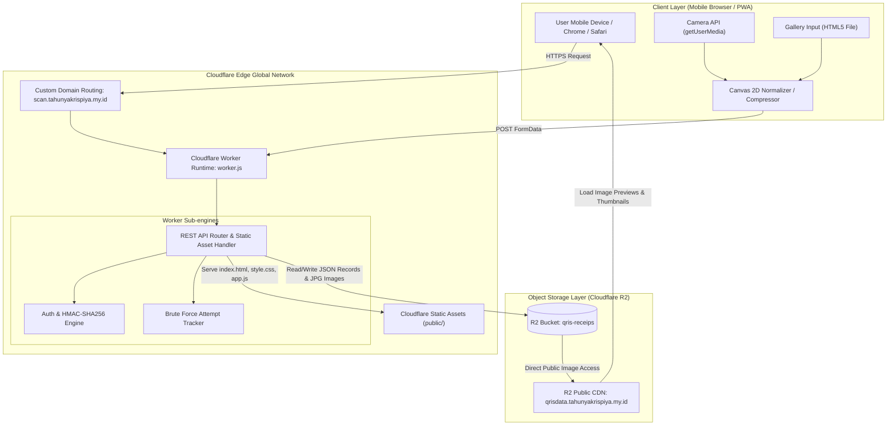

# PRD 01: Arsitektur Sistem Global & Tech Stack

> 💡 **Penjelasan Singkat Bahasa Manusia**:  
> Dokumen ini menjelaskan "cetak biru bangunan" dari aplikasi QRIS Kas. Diibaratkan sebuah toko:
> - **HP Kasir (Frontend)** adalah meja kasir tempat memotret dan mencatat uang.
> - **Cloudflare Workers** adalah staf kasir pintar di awan yang memproses data super cepat tanpa perlu komputer server mahal.
> - **Cloudflare R2** adalah lemari brankas digital tempat menyimpan foto bukti dan catatan uang agar aman dan tidak membebani memori HP kasir.

## 1. Ikhtisar Sistem & Tujuan Produk
**QRIS Nominal Scanner (QRIS Kas)** adalah aplikasi kasir berbasis web serverless (*edge-first PWA*) yang dirancang khusus untuk mempermudah, mempercepat, dan mencatat transaksi pembayaran QRIS secara real-time langsung dari smartphone di gerai fisik.

### Nilai Inti Sistem (*Core Value Proposition*)
1. **Ultra-Fast Transaction Entry**: Mengutamakan kecepatan kasir saat transaksi ramai. Jepret foto kamera langsung mengambil waktu WIB real-time dan membuka dialog nominal tanpa hambatan PIN.
2. **Zero Maintenance Serverless**: Berjalan di atas edge runtime global Cloudflare Workers dengan penyimpanan objek Cloudflare R2 tanpa server database relasional yang mahal/rumit.
3. **Partitioned Storage Design**: Struktur penyimpanan objek terorganisir per tanggal `records/YYYY/MM/DD/` untuk query super cepat berbasis prefix tanpa scan berlebih.
4. **Multi-Tier Security & RBAC**: Akses terproteksi HMAC-SHA256, proteksi brute-force, serta otorisasi bertingkat (Guest View, Admin Entry, Edit with PIN, Delete with 2-Step Verification).

---

## 2. Diagram Topologi Arsitektur



---

## 3. Struktur Direktori Repositori

```
c:/ocr gas/
├── docs/                                # Koleksi PRD dan Spesifikasi Teknis Terstruktur
│   ├── INDEX.md                         # Master index dokumentasi
│   ├── PRD-01_SYSTEM_ARCHITECTURE_AND_STACK.md
│   ├── PRD-02_AUTHENTICATION_AND_SECURITY.md
│   ├── PRD-03_FRONTEND_UI_AND_WORKFLOW.md
│   ├── PRD-04_API_SPECIFICATION_AND_R2_STORAGE.md
│   └── PRD-05_DEPLOYMENT_DEVOPS_AND_RUNBOOK.md
├── public/                              # Aset statis hasil build & distribusi (disajikan oleh ASSETS)
│   ├── app.js                           # Bundle JavaScript minified hasil kompilasi esbuild
│   ├── history.css                      # Styling khusus modul riwayat & rekap harian
│   ├── index.html                       # HTML utama aplikasi single-page (SPA)
│   ├── manifest.webmanifest             # Konfigurasi PWA (Progressive Web App)
│   └── style.css                        # CSS Design System utama (Dark Mode, Glassmorphism, UI Tokens)
├── src/                                 # Kode sumber frontend yang aktif dikembangkan
│   └── app.js                           # Logika inti frontend (DOM, Kamera, Event Handler, Fetch API)
├── .gitignore                           # Konfigurasi pengabaian file Git
├── package.json                         # Definisi dependensi NPM, script build, dan dev
├── package-lock.json                    # Lockfile dependensi NPM
├── README.md                            # Panduan pengembang ringkas
├── worker.js                            # Kode sumber backend Cloudflare Worker (REST API & Auth)
└── wrangler.toml                        # Konfigurasi Cloudflare Wrangler, R2 Bindings, & Routes
```

---

## 4. Analisis Dependensi & Tech Stack

### A. Runtime & Backend
* **Cloudflare Workers**: JavaScript Edge Runtime V8 berbasis Web Standards (Fetch API, Request/Response, Crypto Subtle, FormData).
* **Cloudflare R2 Object Storage**: Penyimpanan objek kompatibel S3 dengan *zero egress fee*, digunakan untuk database record JSON dan file foto bukti pembayaran.

### B. Frontend Engine
* **Vanilla JavaScript (ES2022+)**: Logika murni tanpa framework overhead (React/Vue/Angular), menjamin waktu inisialisasi instan di browser HP kelas bawah.
* **Vanilla CSS (Modern Dark System)**: Desain kustom responsif, dark mode elegan dengan aksen amber/kuning, glassmorphism, dan sistem CSS Variables.
* **HTML5 Media & Canvas API**: `navigator.mediaDevices.getUserMedia` untuk pengambilan frame kamera langsung, dan `<canvas>` untuk resize proporsional (max width 1100px) dan kompresi JPEG kualitas 0.78 sebelum upload.

### C. Build & Tooling (`package.json`)
```json
{
  "name": "qris-nominal-scanner",
  "private": true,
  "version": "1.0.0",
  "type": "module",
  "scripts": {
    "dev": "wrangler dev",
    "build": "esbuild src/app.js --bundle --minify --outfile=public/app.js",
    "deploy": "npm run build && wrangler deploy"
  },
  "devDependencies": {
    "esbuild": "^0.25.0",
    "wrangler": "^4.24.3"
  }
}
```
* **`esbuild`**: Bundler JavaScript super cepat yang menggabungkan dan meminifikasi `src/app.js` menjadi `public/app.js` dalam hitungan milidetik.
* **`wrangler`**: CLI resmi Cloudflare untuk emulasi lokal (`wrangler dev`), manajemen secrets, dan deployment cloud (`wrangler deploy`).

---

## 5. Matriks Environment Variables & Worker Secrets

Aplikasi ini menggunakan perpaduan variabel lingkungan statis di `wrangler.toml` dan rahasia terenkripsi (*Cloudflare Worker Secrets*):

| Nama Variabel / Secret | Tipe | Lokasi Konfigurasi | Deskripsi & Fungsi |
|---|---|---|---|
| `AUTH_USERNAME` | Secret | `wrangler secret put AUTH_USERNAME` | Username login untuk akun Admin. |
| `AUTH_PASSWORD` | Secret | `wrangler secret put AUTH_PASSWORD` | Password login Admin & Verifikasi Tingkat 2 pada saat menghapus transaksi. |
| `AUTH_SECRET` | Secret | `wrangler secret put AUTH_SECRET` | Kunci simetris HMAC-SHA256 untuk menandatangani dan memverifikasi token cookie sesi `qris_session`. |
| `DELETE_PIN` | Secret | `wrangler secret put DELETE_PIN` | Kode PIN 6-digit untuk otorisasi Edit transaksi lama dan Verifikasi Tingkat 1 Hapus transaksi. |
| `DEV_NO_AUTH` | Env Var | `wrangler.toml` / CLI (Opsional) | Jika diset `"true"`, bypass autentikasi untuk pengujian lokal. |
| `R2_PUBLIC_URL` | Env Var | `wrangler.toml` `[vars]` | Domain publik CDN R2 (contoh: `https://qrisdata.tahunyakrispiya.my.id`) untuk menghasilkan URL gambar. |
| `RECEIPTS` | R2 Binding | `wrangler.toml` `[[r2_buckets]]` | Binding runtime JavaScript ke Cloudflare R2 bucket `qris-receips`. |
| `ASSETS` | Assets Binding | `wrangler.toml` `[assets]` | Binding runtime untuk melayani file statis dari folder `./public`. |

---

## 6. Konfigurasi Serverless (`wrangler.toml`)

```toml
name = "qris-nominal-scanner"
main = "worker.js"
compatibility_date = "2026-07-20"

[assets]
directory = "./public"
binding = "ASSETS"
run_worker_first = true

[[r2_buckets]]
binding = "RECEIPTS"
bucket_name = "qris-receips"

[vars]
R2_PUBLIC_URL = "https://qrisdata.tahunyakrispiya.my.id"

[[routes]]
pattern = "scan.tahunyakrispiya.my.id"
custom_domain = true
```
