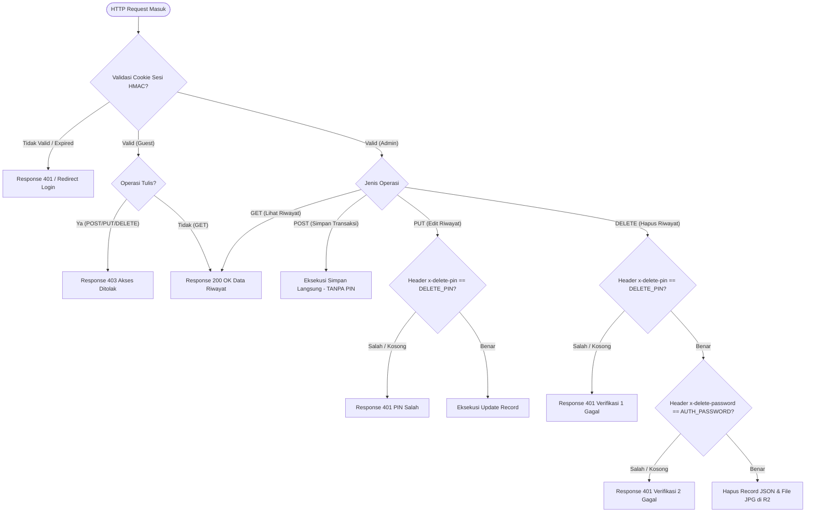

# PRD 02: Model Keamanan, Autentikasi & Otorisasi Bertingkat

> 💡 **Penjelasan Singkat Bahasa Manusia**:  
> Dokumen ini menjelaskan aturan kunci keamanan toko:
> - **Saat Masuk (Login)**: Memakai username & password, atau tombol "Mode Intip" (hanya bisa lihat, tidak bisa utak-atik).
> - **Saat Catat Uang Baru**: Bebas tanpa PIN agar kasir bisa melayani pembeli secepat mungkin.
> - **Saat Mau Ubah Catatan (Edit)**: Wajib masukkan PIN 6-digit agar kasir tidak asal ubah angka setoran.
> - **Saat Mau Hapus Data Permanen**: Wajib Verifikasi 2-Langkah (PIN 6-digit + Password Toko) agar data bukti tidak hilang sembarangan.

## 1. Ikhtisar & Prinsip Keamanan
Sistem **QRIS Nominal Scanner** menerapkan arsitektur keamanan *Defense in Depth* berbasis kriptografi Web Standards (`crypto.subtle`) dan kontrol akses berbasis peran (*Role-Based Access Control / RBAC*). 

Sistem ini didesain agar kasir di lapangan dapat mencatat transaksi dengan sangat cepat tanpa terhalang autentikasi berulang, tetapi memiliki proteksi sangat ketat terhadap manipulasi data finansial, penghapusan bukti transaksi, dan serangan brute-force.

---

## 2. Arsitektur Sesi HMAC-SHA256 (Stateless Cookie)

Sistem menggunakan cookie sesi bertandatangan kriptografis (*Signed Cookie*) tanpa memerlukan database sesi eksternal (*stateless*).

```
Token Format:
[username].[expires_timestamp].[hmac_sha256_hex_signature]
Contoh:
admin.1787839200.5f38a9d182b45e8e9c63b2184ad8d89e7019bc24f6610360a8f9c2d1b...
```

### Alur Kriptografi Sesi
1. **Pembuatan Sesi (`sessionCookie`)**:
   - `username`: Nama pengguna (`env.AUTH_USERNAME` atau `"guest"`).
   - `expires`: `Date.now() / 1000 + 86400 * 7` (Masa berlaku 7 hari).
   - `payload`: `${username}.${expires}`.
   - `signature`: Dihasilkan menggunakan `crypto.subtle.sign("HMAC", HMAC_KEY, payload)` dengan kunci rahasia `env.AUTH_SECRET`.
   - Cookie diset dengan atribut: `HttpOnly; Secure; SameSite=Strict; Max-Age=604800; Path=/`.
2. **Validasi Sesi (`authenticated`)**:
   - Worker membaca cookie `qris_session`.
   - Memisahkan komponen `value` dan `signature`.
   - Mengecek apakah timestamp `expires` sudah melewati waktu saat ini.
   - Menghitung ulang HMAC pada `value` menggunakan `env.AUTH_SECRET`. Jika signature tidak identik (*tampering detected*), permintaan ditolak (401).
   - Mengembalikan peran: `"admin"`, `"guest"`, atau `false`.

---

## 3. Matriks Hak Akses Peran (RBAC)

| Kemampuan / Fitur | Peran `admin` | Peran `guest` (Mode Intip) | Tamu / Tanpa Sesi |
|---|---|---|---|
| Mengakses Halaman Scan & Kamera | ✅ Ya | ❌ Tidak (Tab disembunyikan) | ❌ Redirect ke `/login` |
| Mengunggah Foto & Simpan Transaksi | ✅ Ya (Tanpa PIN) | ❌ Ditolak (403 Forbidden) | ❌ Ditolak (401 Unauthorized) |
| Melihat Daftar Riwayat Transaksi | ✅ Ya | ✅ Ya | ❌ Ditolak (401 Unauthorized) |
| Mengunduh / Bagikan Rekap WhatsApp | ✅ Ya | ✅ Ya | ❌ Ditolak (401 Unauthorized) |
| Mengedit Nominal / Jam Transaksi | ✅ Ya (Wajib PIN) | ❌ Tombol disembunyikan & 403 | ❌ Ditolak (401 Unauthorized) |
| Menghapus Transaksi & Foto R2 | ✅ Ya (Wajib 2-Langkah) | ❌ Tombol disembunyikan & 403 | ❌ Ditolak (401 Unauthorized) |

---

## 4. Otorisasi Bertingkat (*Multi-Tier Authorization*)



### Rincian Tingkatan Otorisasi:

#### 1. Level 1: Input / Simpan Transaksi Baru (`POST /api/receipts`)
* **Syarat**: Sesi login Admin yang valid.
* **Kebijakan PIN**: **TIDAK MEMERLUKAN PIN**.
* **Rasional**: Memaksimalkan kecepatan kasir saat melayani antrean pelanggan di jam sibuk.

#### 2. Level 2: Edit Transaksi Tersimpan (`PUT /api/receipts`)
* **Syarat**: Sesi login Admin + Header HTTP `x-delete-pin` yang cocok dengan `env.DELETE_PIN`.
* **Kebijakan PIN**: **WAJIB PIN 6-DIGIT**.
* **Rasional**: Mencegah kasir atau pihak yang memegang HP mengubah riwayat penjualan tanpa otorisasi pemilik toko.

#### 3. Level 3: Hapus Transaksi Permanen (`DELETE /api/receipts`)
* **Syarat**: Sesi login Admin + **Verifikasi 2-Langkah**:
  1. Header HTTP `x-delete-pin` == `env.DELETE_PIN` (Secret PIN Hapus).
  2. Header HTTP `x-delete-password` == `env.AUTH_PASSWORD` (Password Admin).
* **Rasional**: Penghapusan data bersifat destruktif dan permanen (menghapus record JSON dan file JPG di R2). Wajib menggunakan dua lapisan rahasia terpisah.

---

## 5. Mitigasi Serangan Brute-Force pada Login

Untuk mencegah serangan tebak password (*brute-force attack*), Worker menerapkan sistem pelacak percobaan login:
1. Setiap kegagalan autentikasi di `POST /login` menaikkan counter dalam cookie terenkripsi `login_attempts`.
2. Jika counter mencapai `attempts >= 5`:
   - Endpoint login langsung mengembalikan respon `401 Unauthorized` dengan pesan: *"Terlalu banyak percobaan gagal. Tunggu beberapa menit."*.
   - Cookie lockout diset dengan `Max-Age=300` (blokir selama 5 menit).
3. Jika login berhasil, cookie `login_attempts` langsung direset ke `0` dengan `Max-Age=0`.

---

## 6. Penyimpanan Kredensial di Sisi Klien (*Client-Side State*)

* PIN verifikasi dan Password Admin disimpan sementara di `sessionStorage` browser setelah pertama kali dimasukkan dengan benar.
* Jika server mengembalikan `401 Unauthorized` pada saat Edit atau Hapus:
  ```javascript
  sessionStorage.removeItem("deletePin");
  sessionStorage.removeItem("deletePassword");
  ```
  Sistem secara otomatis menghapus kredensial yang tersimpan di sesi browser untuk memaksa pengguna memasukkan kredensial baru.
* `sessionStorage` otomatis terhapus saat tab atau browser ditutup, mencegah kebocoran kredensial jika HP dipinjamkan.
