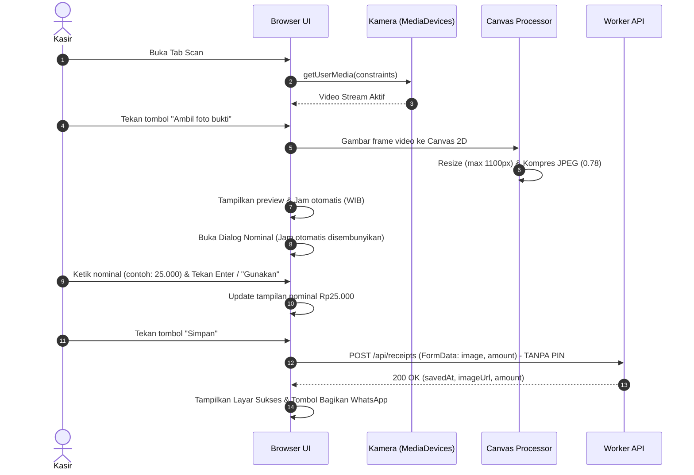
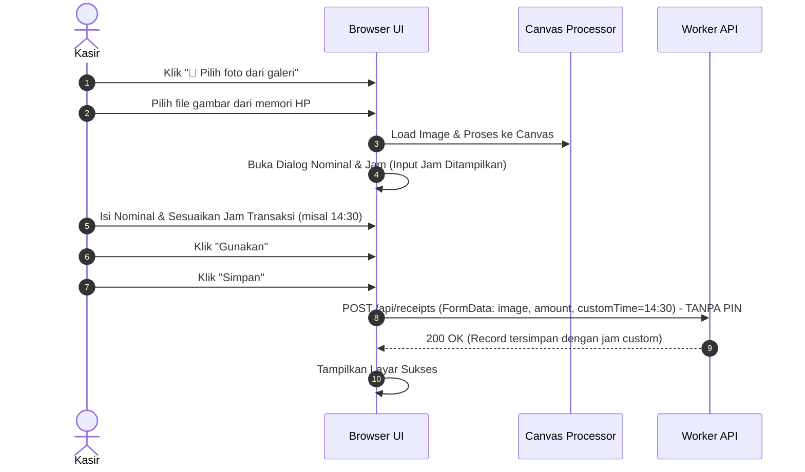

# PRD 03: Frontend UI, UX & Alur Kerja Klien (*Client Workflows*)

> 💡 **Penjelasan Singkat Bahasa Manusia**:  
> Dokumen ini menjelaskan tampilan layar HP kasir dan apa yang terjadi saat tombol-tombol diklik:
> - **Jepret Foto**: Kamera HP mengambil foto, langsung memperkecil ukuran foto agar hemat kuota internet, dan langsung meminta kasir mengisi nominal uang.
> - **Upload Galeri**: Digunakan jika pelanggan kirim bukti via WhatsApp, kasir bisa mencocokkan jam transfer sesuai bukti struk.
> - **Kirim Rekap WA**: Sekali klik tombol hijau, teks rekap rapi otomatis siap dikirim ke nomor WhatsApp bos.

## 1. Ikhtisar & Arsitektur Frontend
Frontend **QRIS Nominal Scanner** dibangun dengan pendekatan *Zero-Framework High Performance SPA* menggunakan Vanilla JavaScript ES2022, HTML5 Semantic, dan Vanilla CSS Variables. 

Arsitektur ini menghilangkan bundle overhead (ukuran bundle hanya ~10 KB) dan memastikan runtime berkinerja tinggi, bebas jank, serta kompatibel dengan peramban mobile (Android Chrome, iOS Safari).

```
Pipeline Kompilasi Frontend:
src/app.js (Modul Sumber) ───[ esbuild --bundle --minify ]───> public/app.js (10.1 KB Minified)
```

---

## 2. Sistem Desain & Token CSS (*Design Tokens*)

Aplikasi menggunakan tema **Dark Studio Glassmorphism** dengan palet warna amber/gold bercahaya (*glow*) yang kontras dan nyaman di mata untuk penggunaan kasir di ruangan terang maupun redup.

### Token Warna & Variabel Utama (`public/style.css`)
```css
:root {
  --bg: #0a0903;                     /* Background utama gelap pekat */
  --card: #141208;                   /* Kartu container */
  --card-glass: rgba(20, 18, 8, 0.85);/* Efek kaca tembus pandang */
  --line: #342c10;                   /* Garis tepi / border elegan */
  --yellow: #ffd000;                 /* Warna aksen utama (Emas QRIS) */
  --yellow-light: #ffe566;           /* Gradasi kuning terang */
  --yellow-dark: #cc9f00;            /* Warna aksen kuning gelap */
  --yellow-glow: rgba(255, 208, 0, 0.25); /* Glow aksen tombol */
  --ink: #fffef5;                    /* Teks putih terang */
  --muted: #a89f82;                  /* Teks redup / label */
  --red: #ff5555;                    /* Warna status bahaya / hapus */
}
```

---

## 3. Alur Kerja Klien (*Detailed Client Workflows*)

### A. Alur 1: Jepret Cepat Kamera (*Fast Camera Shutter Flow*)

Alur ini dirancang untuk kecepatan maksimal saat melayani pelanggan secara langsung.



#### Detail Teknis Alur Kamera:
1. **Deteksi Konteks Aman (`isSecureContext`)**:
   Memeriksa `https:` atau `localhost`. Jika tidak aman, kamera dinonaktifkan dengan panduan jelas.
2. **Multi-Constraint Fallback**:
   Menggunakan array fallback resolusi ideal `1280x720` dan mode hadap kamera (`environment` vs `user`).
3. **Toggle Kamera Depan/Belakang**:
   Tombol `📷 Depan` / `📷 Belakang` mengubah preferensi yang disimpan di `localStorage("preferredFacingMode")`.
4. **Optimalisasi Canvas & Blob**:
   Mengubah dimensi gambar dengan rasio aspek terjaga:
   ```javascript
   const w = s.videoWidth, h = s.videoHeight, max = 1100, z = Math.min(1, max / w);
   canvas.width = Math.round(w * z);
   canvas.height = Math.round(h * z);
   ```

---

### B. Alur 2: Ambil Foto dari Galeri (*Gallery Upload Flow*)

Alur ini digunakan saat kasir mengunggah tangkapan layar (*screenshot*) atau foto struk yang diambil beberapa waktu sebelumnya.



---

### C. Alur 3: Riwayat & Rekap Harian (*History & Daily Recap*)

Memungkinkan admin dan kasir melihat seluruh catatan transaksi per hari dan membuat rekap siap kirim ke WhatsApp pemilik toko.

1. **Pemilihan Tanggal**: Input tanggal `#historyDate` default ke tanggal hari ini zona waktu `Asia/Jakarta`.
2. **Fetch Riwayat**: Mengambil `GET /api/receipts?date=YYYY-MM-DD`.
3. **Rendering Dinamis**:
   - Menampilkan list kartu transaksi: foto thumbnail, jam WIB, nominal rupiah berformat `Rp18.000`, dan link langsung ke file bukti R2.
   - Jika login sebagai `admin`, menampilkan tombol `Edit` dan `Hapus`.
   - Jika login sebagai `guest`, menyembunyikan aksi modifikasi.
4. **Pembuatan Pesan Rekap WhatsApp**:
   Format otomatis teks rekap siap bagikan:
   ```text
   *REKAP TRANSAKSI QRIS (27 Agustus 2026)*

   1. 08:15 - 18.000
   2. 09:30 - 25.000
   3. 11:45 - 50.000

   *Total QRIS: Rp93.000*

   Link bukti:
   1. https://qrisdata.tahunyakrispiya.my.id/images/2026/08/27/081520-18000-a1b2c3d4.jpg
   2. https://qrisdata.tahunyakrispiya.my.id/images/2026/08/27/093012-25000-e5f6g7h8.jpg
   3. https://qrisdata.tahunyakrispiya.my.id/images/2026/08/27/114555-50000-i9j0k1l2.jpg
   ```
5. **Integrasi Web Share API**:
   Menggunakan `navigator.share()` native. Jika peramban tidak mendukung, otomatis redirect ke `https://wa.me/?text=...`.

---

### D. Alur 4: Edit Transaksi di Riwayat (*Edit Record Flow*)

1. Kasir/Admin mengklik tombol **Edit** pada salah satu baris riwayat.
2. Muncul dialog prompt JavaScript:
   - Prompt 1: *Edit Nominal Rupiah*
   - Prompt 2: *Edit Jam (format HH:mm)*
   - Prompt 3: *Masukkan 6-digit PIN verifikasi*
3. Mengirimkan request `PUT /api/receipts` dengan header `x-delete-pin`.
4. Jika berhasil, riwayat dimuat ulang otomatis dan menampilkan data baru.

---

### E. Alur 5: Hapus Transaksi Permanen (*Delete Record Flow*)

1. Admin mengklik tombol **Hapus** pada baris riwayat.
2. Modal `<dialog id="deleteDialog">` muncul dengan peringatan jelas:
   - Menampilkan info transaksi: *Hapus transaksi Rp18.000 (08:15 WIB) beserta foto bukti di R2?*
   - Field 1: **PIN Hapus (6-digit)**.
   - Field 2: **Password Admin**.
3. Admin menekan tombol **Hapus Permanen**.
4. Mengirimkan request `DELETE /api/receipts` dengan header `x-delete-pin` dan `x-delete-password`.
5. Jika kedua verifikasi cocok, record JSON dan file foto JPG di R2 dihapus secara permanen.
